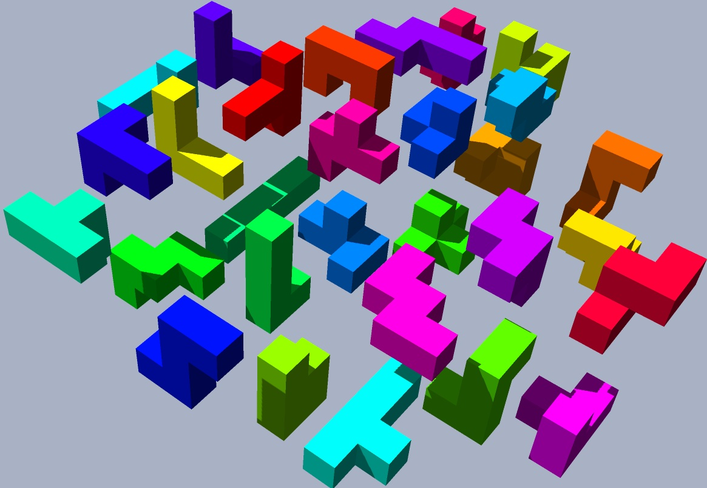

### or-tools: Examples and Models

#### Seating - A Delegate Seating Problem
_This is the problem that introduced me to **or-tools**._

There is a one day event that covers several named sessions.
The seating for the event does not change: seats are arranged in named rows of different lengths. 

Company (organisation) delegates should always sit together, and a delegate should not have to switch seats if attending successive sessions.

What makes this more complex than e.g. a wedding planner is that delegates do not go to all sessions.

So, the constraints are:
* Seating is in rows. Each row has an arbitrary number of seats. 
* Each named delegate belongs to one named organisation.
* Each delegate will attend at least one session.
* Delegates of each organisation sit in adjacent seats in a session.
* Each delegate will sit in the same place in consecutive sessions.
* Each seat can only sit one delegate per session.
* Each delegate is assigned a maximum of one chair in each session.

#### Chessboard - legal pieces puzzle
Given a library of pieces and their moves, 
and given a requirement of which pieces to use, and how many,
determine a solution such that no piece can be taken by another.

This is an extension of the N-Queens puzzle
E.g. find a solution for 6 queens, 2 knights, and maximum (2) kings.

     ♞■□■□■□♚
     ■□■♛■□■□
     □■□■□■♛■
     ■□♛□■□■□
     □■□■□♛□■
     ■♛■□■□■□
     □■□■♛■□■
     ♚□■□■□■♞

#### Polyomino Puzzle Solver
This solves filling a space with a set of defined polyominoes.

_A polyomino is a plane geometric figure formed by joining one or more equal squares edge to edge.
It is a polyform whose cells are squares. It may be regarded as a finite subset of the regular square tiling._

This example includes a pentomino class.

A standard pentomino puzzle is to tile a rectangular box with the pentominoes, i.e. cover it without overlap and
without gaps. Each of the 12 pentominoes has an area of 5 unit squares, so the box must have an area of 60 units.
Possible sizes that use just one of each pentomino are 6×10, 5×12, 4×15 and 3×20.
The 6×10 case, first solved in 1960, has exactly 2339 solutions.
The 5×12 box has 1010 solutions, the 4×15 box has 368 solutions, and the 3×20 box has just 2 solutions
The 8×8 rectangle with a 2×2 hole in the center has 65 solutions.

This program allows any grid (with arbitrary holes) and allows a variety of shapes to be used to fill it.
e.g. 10x12 grid, with 8 x 'U' pentominoes and 1 or more 'F'.
If successful, it returns a box drawing of the result, e.g. for a 3x20 grid with 1 of each pentomino:

    ╔═══╦═╦═════╦═══════╦═╦═════╦═══╦═╦═════╗
    ║ ╔═╝ ╚═╗   ║ ╔═══╦═╝ ╚═╗ ╔═╝ ╔═╣ ╚═══╗ ║
    ║ ╚═╗ ╔═╩═══╩═╩═╗ ╚═══╗ ║ ║ ╔═╝ ╚═══╗ ║ ║
    ╚═══╩═╩═════════╩═════╩═╩═╩═╩═══════╩═╩═╝

#### Polycube Puzzle Solver
This solves filling a 3D space with a set of defined polycubes.
It is roughly the same as the polyomino solver, but extended to three dimensions.

A pentacube is a polycube composed of 5 cubes.
There are 29 distinct three-dimensional pentacubes (Bouwkamp 1981).
Of these, the 12 planar pentacubes (corresponding to solid pentominoes), are well known.
Among the non-planar pentacubes, there are five that have at least one plane of symmetry;
Each of them is its own mirror image. The remaining 12 pentacubes come in mirror image pairs.

This will generate obj/mtl 3D 'Wavefront' files of the solution.

